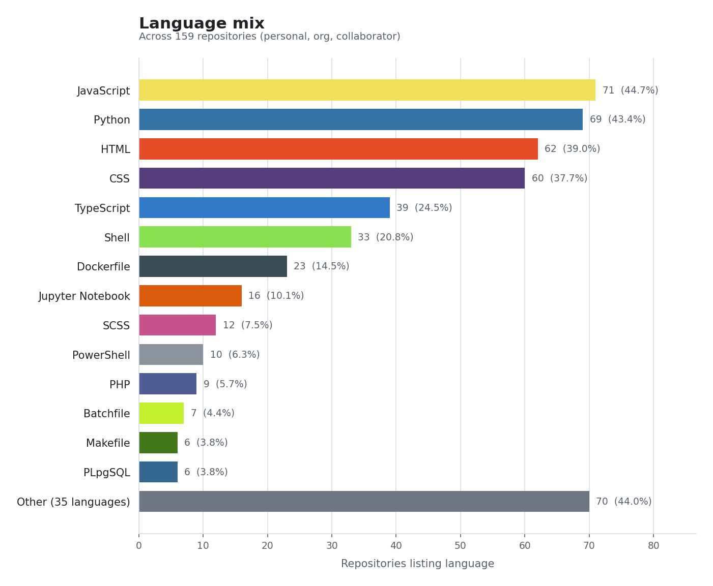

## Senior Software Engineer

Senior software engineer focused on **production systems**, **machine learning**, **MLOps**, and **applied research**. Work spans end-to-end development, model deployment, data pipelines, and collaboration with product and platform teams to ship reliable, scalable software and ML systems.

<!-- github-stats:auto:start member-line -->
**GitHub:** member since **17 July 2021** (~**5 years** on the platform).
<!-- github-stats:auto:end member-line -->

---

## My services

- **Game automation:** build and maintain bots for **flash/browser games** (e.g. real-time input, state parsing, anti-detection patterns where appropriate).
- **Token & community growth:** design and implement **airdrop** eligibility, distribution, and anti-abuse strategy (snapshot rules, claiming flows, monitoring).
- **Trading & markets tooling:** bots and data pipelines for exchanges, prediction markets, and indicators (see public repositories).
- **Web3 & bots:** smart contracts, TON/Tact, NFT and marketplace backends, Telegram and Discord automation.
- **ML & agents:** production ML, LLM/RAG workflows, and coding-agent style automation.

---

## GitHub statistics

<!-- github-stats:auto:start core-stats -->
### Account snapshot

| Metric | Value |
| --- | --- |
| **Joined** | 17 July 2021 (~4.7 calendar years; **~5 years** rounded) |
| **Public repositories** | **61** |
| **Followers · Following** | **215** · **106** |
| **Stars received** | **32** |
| **Pull requests · Issues** (opened, account lifetime) | **6** · **1** |

### Languages by code volume

| Language | Repositories | % of repos |
| --- | ---: | ---: |
| Python | 32 | 45.7% |
| HTML | 16 | 22.9% |
| JavaScript | 14 | 20.0% |
| Jupyter Notebook | 13 | 18.6% |
| CSS | 11 | 15.7% |
| TypeScript | 9 | 12.9% |
| Dockerfile | 5 | 7.1% |
| Ruby | 4 | 5.7% |
| Shell | 4 | 5.7% |
| Rust | 3 | 4.3% |
| Java | 2 | 2.9% |
| Makefile | 2 | 2.9% |
| PLpgSQL | 2 | 2.9% |
| AMPL | 1 | 1.4% |
| Batchfile | 1 | 1.4% |
| Boogie | 1 | 1.4% |
| C | 1 | 1.4% |
| C# | 1 | 1.4% |
| C++ | 1 | 1.4% |
| Cuda | 1 | 1.4% |
| Go | 1 | 1.4% |
| Kotlin | 1 | 1.4% |
| MDX | 1 | 1.4% |
| Move | 1 | 1.4% |
| PHP | 1 | 1.4% |
| R | 1 | 1.4% |
| SCSS | 1 | 1.4% |
| Swift | 1 | 1.4% |
| Tree-sitter Query | 1 | 1.4% |

### Language mix (visualization)

<!-- github-stats:auto:end core-stats -->

---

## Skills and tools

The following reflects languages, frameworks, and platforms used across **public and private** owned repositories in the collected GitHub data (see the generated language list) and in broader professional work.

<!-- github-stats:auto:start skills-languages -->
**Languages:** JavaScript / TypeScript, C / C++, AMPL, Batchfile, Boogie, C#, CSS, Cuda, Dockerfile, Go, HTML, Java, Jupyter (notebooks), Kotlin, Makefile, MDX, Move, PHP, PLpgSQL, Python, R, Ruby, Rust, SCSS, Shell, Swift, Tact (TON), Tree-sitter Query, Matlab, SQL
<!-- github-stats:auto:end skills-languages -->

**Machine learning & AI:** classical ML, deep learning, computer vision, NLP, PyTorch, TensorFlow, Keras, OpenCV, MediaPipe, EfficientNet, StyleGAN2, neural ODEs, recommendation systems (e.g. LightFM), LLMs, RAG, LangChain / LangGraph, QLoRA / fine-tuning, coding agents and SWE-bench style tooling

**Data & analytics:** data science, ETL, visualization, data engineering, modeling, mining and quality; time series and statistics

**Web & applications:** Node.js, React, Django, Flask, Discord bots, VS Code extensions, ServiceNow (including Utah NeedIt training flows), Drupal

**Cloud, infra & MLOps:** Azure, Terraform, container workflows, Cloudflare R2, active-container style deployments

**Other domains:** blockchain and Web3 (e.g. IOTA, TON, Bittensor agents), crypto exchange data, quantum demos (QFT), trading and strategy analysis (non-personal)

---

### Repositories

<!-- github-stats:auto:start repos -->
**61** public repositories (verified **2026-04-13** against the GitHub API; descriptions are taken from each repo README when available, then the GitHub description, then a short fallback).

| Repository | Description |
| --- | --- |
| [active-containers-ui](https://github.com/stevewoz1234567890/active-containers-ui) | Active Containers UI — public Python repository. |
| [agentic-engineering-with-clojure](https://github.com/iwillig/agentic-engineering-with-clojure) | Agentic Engineering with Clojure |
| [ai-agent-learning](https://github.com/stevewoz1234567890/ai-agent-learning) | ai-agent-learning |
| [AI-Translation](https://github.com/stevewoz1234567890/AI-Translation) | AI-Translation using GoogleTranslator |
| [Avitation](https://github.com/miguel-so/Avitation) | I want NextJS web based admin portal dashboard UI and separated independent Node.js + ExpressJS + MySQL backend to interact with admin portal and avitation Landing page built in wordpress, avitation mobile apps. |
| [awesome-elegant-prompts](https://github.com/stevewoz1234567890/awesome-elegant-prompts) | ✨ Awesome Elegant Prompts |
| [beat-gpt4o](https://github.com/stevewoz1234567890/beat-gpt4o) | Beat GPT-4o — public Python repository. |
| [Bellman-euqation](https://github.com/stevewoz1234567890/Bellman-euqation) | Bellman |
| [canon-camera-controller](https://github.com/stevewoz1234567890/canon-camera-controller) | Python API to interact with Canon CCAPI |
| [capsult-network-on-brats](https://github.com/stevewoz1234567890/capsult-network-on-brats) | capsult-network-on-brats |
| [claude-code-discussion](https://github.com/stevewoz1234567890/claude-code-discussion) | Claude Code — curated practice notes |
| [cleenq](https://github.com/miguel-so/cleenq) | Cleenq — public TypeScript repository. |
| [Clojure-discussion](https://github.com/stevewoz1234567890/Clojure-discussion) | Clojure Development |
| [coco-format-in-pytorch](https://github.com/stevewoz1234567890/coco-format-in-pytorch) | COCO Format In Pytorch — public Jupyter Notebook repository. |
| [code-generation-agent-for-SWEbench](https://github.com/stevewoz1234567890/code-generation-agent-for-SWEbench) | code-generation-agent-for-SWEbench |
| [code_generation_langchain](https://github.com/stevewoz1234567890/code_generation_langchain) | Copilot Travel Engine |
| [coffee-analysis](https://github.com/stevewoz1234567890/coffee-analysis) | Coffee Analysis — public Jupyter Notebook repository. |
| [collective-exploration](https://github.com/zero10xy/collective-exploration) | Collective-Exploration |
| [compamy-house-csv](https://github.com/miguel-so/compamy-house-csv) | Companies House Advanced Search with Director Export |
| [Complex-Network-Theory](https://github.com/stevewoz1234567890/Complex-Network-Theory) | Complex Network Theory — public code repository. |
| [cortnie](https://github.com/stevewoz1234567890/cortnie) | Cortnie — public HTML repository. |
| [CS2210a_DS_java](https://github.com/stevewoz1234567890/CS2210a_DS_java) | CS2210a_DS_java |
| [CSCI-E-25-lecture](https://github.com/stevewoz1234567890/CSCI-E-25-lecture) | CSCI E 25 Lecture — public Jupyter Notebook repository. |
| [devtraining-needit-utah](https://github.com/stevewoz1234567890/devtraining-needit-utah) | Generated files |
| [disocrd-bot](https://github.com/stevewoz1234567890/disocrd-bot) | pip install -U discord.py |
| [drupal-issues](https://github.com/stevewoz1234567890/drupal-issues) | Drupal contribution intelligence |
| [dulcinea-admin](https://github.com/miguel-so/dulcinea-admin) | Dulcinea Admin — public CSS repository. |
| [E-commerce-Returns-Prediction-Challenge](https://github.com/stevewoz1234567890/E-commerce-Returns-Prediction-Challenge) | E Commerce Returns Prediction Challenge — public Jupyter Notebook repository. |
| [Exponential-Grid-Navigation-System](https://github.com/stevewoz1234567890/Exponential-Grid-Navigation-System) | Exponential Grid Navigation System — public C# repository. |
| [FE-ebay-api-cron](https://github.com/miguel-so/FE-ebay-api-cron) | eBay Listing Monitor |
| [Fetch-Data-Crypto-Exchange](https://github.com/stevewoz1234567890/Fetch-Data-Crypto-Exchange) | Fetch Data Crypto Exchange — public Python repository. |
| [firebase-discussion](https://github.com/stevewoz1234567890/firebase-discussion) | Firebase Discussion |
| [flight-path-tracker](https://github.com/stevewoz1234567890/flight-path-tracker) | Flight Path Tracker API |
| [Foreign_Body_Detection_Xray_Deep_Learning](https://github.com/stevewoz1234567890/Foreign_Body_Detection_Xray_Deep_Learning) | Synthetic Data Creation for the Improvement of the Performance of Classifiers. |
| [Get_Finshi_MTG](https://github.com/stevewoz1234567890/Get_Finshi_MTG) | Get_Finshi_MTG |
| [huggingface.co-issues](https://github.com/stevewoz1234567890/huggingface.co-issues) | Huggingface.co Issues — public code repository. |
| [iota](https://github.com/stevewoz1234567890/iota) | IOTA |
| [lightfm](https://github.com/stevewoz1234567890/lightfm) | LightFM |
| [MERN-artwork](https://github.com/miguel-so/MERN-artwork) | Dulcinea-Art - MERN Stack Artwork Gallery |
| [Meza](https://github.com/stevewoz1234567890/Meza) | Meza — public Java repository. |
| [MQDF-with-MNIST](https://github.com/stevewoz1234567890/MQDF-with-MNIST) | MQDF-with-MNIST |
| [Name-Classification](https://github.com/stevewoz1234567890/Name-Classification) | Name Classification — public Python repository. |
| [Neural_ODEs](https://github.com/stevewoz1234567890/Neural_ODEs) | Neural ODEs — public Jupyter Notebook repository. |
| [openclaw](https://github.com/stevewoz1234567890/openclaw) | 🦞 OpenClaw — Personal AI Assistant |
| [Packaging-Optimization](https://github.com/stevewoz1234567890/Packaging-Optimization) | 3D Package Optimization |
| [Pose-Classification-with-Mediapipe](https://github.com/stevewoz1234567890/Pose-Classification-with-Mediapipe) | Mediapipe |
| [powerball](https://github.com/stevewoz1234567890/powerball) | Advanced Lottery Prediction System |
| [Probids](https://github.com/miguel-so/Probids) | Probids Platform |
| [qlora](https://github.com/stevewoz1234567890/qlora) | Qlora — public Jupyter Notebook repository. |
| [Quantum-Fourier-Transform](https://github.com/stevewoz1234567890/Quantum-Fourier-Transform) | Quantum Fourier Transform — public Python repository. |
| [Qui-Gon_LP](https://github.com/stevewoz1234567890/Qui-Gon_LP) | Qui-Gon_LP |
| [ridges](https://github.com/stevewoz1234567890/ridges) | Ridges - SN62 |
| [Ruby-and-Rails-Discussion](https://github.com/stevewoz1234567890/Ruby-and-Rails-Discussion) | Ruby & Rails Development |
| [rust-test](https://github.com/stevewoz1234567890/rust-test) | Streamed Cache Interview Question |
| [scrap_linkedin_llm](https://github.com/stevewoz1234567890/scrap_linkedin_llm) | Scrap Linkedin LLM — public HTML repository. |
| [scrum-board-node](https://github.com/stevewoz1234567890/scrum-board-node) | Scrum Board Node — public JavaScript repository. |
| [shape_predictor_81_face_landmarks](https://github.com/stevewoz1234567890/shape_predictor_81_face_landmarks) | 81 Facial Landmarks Shape Predictor |
| [sierpinski](https://github.com/stevewoz1234567890/sierpinski) | Sierpinski — public Python repository. |
| [Skin-Cancer-Classification-using-EfficientNet](https://github.com/stevewoz1234567890/Skin-Cancer-Classification-using-EfficientNet) | Skin Cancer Classification Using Efficient Net — public Jupyter Notebook repository. |
| [sn-learn-javascript](https://github.com/stevewoz1234567890/sn-learn-javascript) | Welcome to Learn JavaScript on the Now Platform! |
| [spectrographic](https://github.com/stevewoz1234567890/spectrographic) | Spectrographic — public Python repository. |
| [stats-test](https://github.com/stevewoz1234567890/stats-test) | Stats Test — public code repository. |
| [stevewoz1234567890](https://github.com/stevewoz1234567890/stevewoz1234567890) | ## Senior Software Engineer |
| [StyleGAN2](https://github.com/stevewoz1234567890/StyleGAN2) | Gradient StyleGAN2 Template Repo |
| [tact-script-in-Ton](https://github.com/stevewoz1234567890/tact-script-in-Ton) | Tact template project |
| [video-hover-effect](https://github.com/stevewoz1234567890/video-hover-effect) | video-hover-effect |
| [vscode-extension-test](https://github.com/stevewoz1234567890/vscode-extension-test) | Vscode Extension Test — public JavaScript repository. |
| [Wine-Name-Match](https://github.com/stevewoz1234567890/Wine-Name-Match) | Wine-Name-Match |
| [wishlist](https://github.com/stevewoz1234567890/wishlist) | Wish List Now Platform Application |
| [x-algorithm](https://github.com/stevewoz1234567890/x-algorithm) | X For You Feed Algorithm |

*Last synced from the GitHub API: 2026-04-13 — public repository list and descriptions (token recommended for rate limits).*
<!-- github-stats:auto:end repos -->
