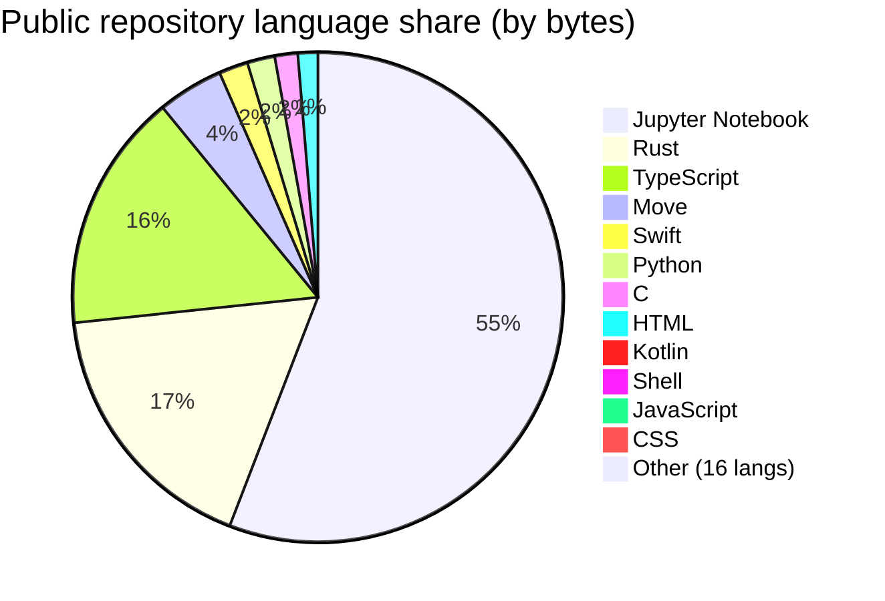

## Senior Software Engineer

Senior software engineer focused on **production systems**, **machine learning**, **MLOps**, and **applied research**. Work spans end-to-end development, model deployment, data pipelines, and collaboration with product and platform teams to ship reliable, scalable software and ML systems.

<!-- github-stats:auto:start member-line -->
**GitHub:** member since **17 July 2021** (~**5 years** on the platform).
<!-- github-stats:auto:end member-line -->
The statistics below are based on **public** repositories only (names, counts, and language bytes from the GitHub API). Contribution history reflects your account's activity on GitHub.

---

## My services

- **Game automation:** build and maintain bots for **flash/browser games** (e.g. real-time input, state parsing, anti-detection patterns where appropriate).
- **Token & community growth:** design and implement **airdrop** eligibility, distribution, and anti-abuse strategy (snapshot rules, claiming flows, monitoring).
- **Trading & markets tooling:** bots and data pipelines for exchanges, prediction markets, and indicators (see public repositories).
- **Web3 & bots:** smart contracts, TON/Tact, NFT and marketplace backends, Telegram and Discord automation.
- **ML & agents:** production ML, LLM/RAG workflows, and coding-agent style automation.

---

## GitHub statistics

<!-- github-stats:auto:start core-stats -->
*Language totals sum the `languages` API bytes per public repo (`.ipynb` → Jupyter Notebook). **Last updated:** April 2026.*

*Set GITHUB_TOKEN for GraphQL: yearly contribution breakdown and "Repositories contributed to" count.*

### Account snapshot

| Metric | Value |
| --- | --- |
| **Joined** | 17 July 2021 (~4.7 calendar years; **~5 years** rounded) |
| **Public repositories** | **61** |
| **Followers · Following** | **215** · **106** |
| **Stars received** | **24** |
| **Pull requests · Issues** (opened; GitHub search on visible/indexed items) | **6** · **1** |
| **Repositories contributed to** (outside owned) | *Requires `GITHUB_TOKEN` (GraphQL).* |
| **Approx. codebase size** (public repos, sum of language bytes) | **~145 MB** |

*PR/issue totals use the REST Search API (`author:login` with `is:pr` / `is:issue`). That index is visibility-sensitive and often **undercounts** dashboard totals when you work in private repositories. With `GITHUB_TOKEN`, this script prefers GraphQL `User` totals instead.*

### Contributions by calendar year

*Calendar = GitHub contribution graph total for 1 Jan–31 Dec (UTC window from the API). **2026** is year-to-date. Commit/PR sub-totals come from GitHub's contribution breakdown for the same period.*

*Contribution table omitted — set `GITHUB_TOKEN` and re-run `collect_github_stats.py`.*

### Languages by code volume (public repos)

*Share of total bytes across **public** repositories (GitHub `languages` API).*

| Language | Share | Approx. |
| --- | ---: | ---: |
| Jupyter Notebook | 55.3% | ~80.3 MB |
| Rust | 17.3% | ~25.2 MB |
| TypeScript | 15.6% | ~22.7 MB |
| Move | 4.3% | ~6.3 MB |
| Swift | 1.9% | ~2.7 MB |
| Python | 1.8% | ~2.6 MB |
| C | 1.5% | ~2.1 MB |
| HTML | 1.3% | ~1.9 MB |
| Kotlin | 0.2% | ~0.3 MB |
| Shell | 0.2% | ~0.3 MB |
| JavaScript | 0.2% | ~0.2 MB |
| CSS | 0.1% | ~0.2 MB |
| R | 0.1% | ~91.5 KB |
| Java | 0.0% | ~72.0 KB |
| *Long tail (14 languages, combined)* | 0.2% | ~0.2 MB |

*Long tail: AMPL, Boogie, C#, C++, Cuda, Dockerfile, Go, Makefile, MDX, PHP, PLpgSQL, Ruby, SCSS, Tree-sitter Query.*

### Language mix (visualization)

<!-- github-stats:auto:end core-stats -->

---

## Skills and tools

The following reflects languages, frameworks, and platforms used in **public** repositories and in professional work.

**Languages:** Python, R, JavaScript / TypeScript, Java, C / C++, Rust, Matlab, SQL, Tact (TON)

**Machine learning & AI:** classical ML, deep learning, computer vision, NLP, PyTorch, TensorFlow, Keras, OpenCV, MediaPipe, EfficientNet, StyleGAN2, neural ODEs, recommendation systems (e.g. LightFM), LLMs, RAG, LangChain / LangGraph, QLoRA / fine-tuning, coding agents and SWE-bench style tooling

**Data & analytics:** data science, ETL, visualization, data engineering, modeling, mining and quality; time series and statistics

**Web & applications:** Node.js, React, Django, Flask, Discord bots, VS Code extensions, ServiceNow (including Utah NeedIt training flows), Drupal

**Cloud, infra & MLOps:** Azure, Terraform, container workflows, Cloudflare R2, active-container style deployments

**Other domains:** blockchain and Web3 (e.g. IOTA, TON, Bittensor agents), crypto exchange data, quantum demos (QFT), trading and strategy analysis (non-personal)

---

### Repositories

<!-- github-stats:auto:start repos -->
**61** public repositories (verified **2026-04-12** against the GitHub API; descriptions use the repo's GitHub field when set, otherwise a short summary).

| Repository | Description |
| --- | --- |
| [active-containers-ui](https://github.com/stevewoz1234567890/active-containers-ui) | — |
| [ai-agent-learning](https://github.com/stevewoz1234567890/ai-agent-learning) | — |
| [AI-Translation](https://github.com/stevewoz1234567890/AI-Translation) | — |
| [awesome-elegant-prompts](https://github.com/stevewoz1234567890/awesome-elegant-prompts) | — |
| [beat-gpt4o](https://github.com/stevewoz1234567890/beat-gpt4o) | — |
| [Bellman-euqation](https://github.com/stevewoz1234567890/Bellman-euqation) | — |
| [canon-camera-controller](https://github.com/stevewoz1234567890/canon-camera-controller) | — |
| [capsult-network-on-brats](https://github.com/stevewoz1234567890/capsult-network-on-brats) | — |
| [claude-code-discussion](https://github.com/stevewoz1234567890/claude-code-discussion) | — |
| [Clojure-discussion](https://github.com/stevewoz1234567890/Clojure-discussion) | — |
| [coco-format-in-pytorch](https://github.com/stevewoz1234567890/coco-format-in-pytorch) | — |
| [code-generation-agent-for-SWEbench](https://github.com/stevewoz1234567890/code-generation-agent-for-SWEbench) | — |
| [code_generation_langchain](https://github.com/stevewoz1234567890/code_generation_langchain) | — |
| [coffee-analysis](https://github.com/stevewoz1234567890/coffee-analysis) | — |
| [Complex-Network-Theory](https://github.com/stevewoz1234567890/Complex-Network-Theory) | — |
| [cortnie](https://github.com/stevewoz1234567890/cortnie) | — |
| [CS2210a_DS_java](https://github.com/stevewoz1234567890/CS2210a_DS_java) | — |
| [CSCI-E-25-lecture](https://github.com/stevewoz1234567890/CSCI-E-25-lecture) | — |
| [devtraining-needit-utah](https://github.com/stevewoz1234567890/devtraining-needit-utah) | — |
| [disocrd-bot](https://github.com/stevewoz1234567890/disocrd-bot) | — |
| [drupal-issues](https://github.com/stevewoz1234567890/drupal-issues) | — |
| [E-commerce-Returns-Prediction-Challenge](https://github.com/stevewoz1234567890/E-commerce-Returns-Prediction-Challenge) | — |
| [Exponential-Grid-Navigation-System](https://github.com/stevewoz1234567890/Exponential-Grid-Navigation-System) | — |
| [Fetch-Data-Crypto-Exchange](https://github.com/stevewoz1234567890/Fetch-Data-Crypto-Exchange) | — |
| [firebase-discussion](https://github.com/stevewoz1234567890/firebase-discussion) | — |
| [flight-path-tracker](https://github.com/stevewoz1234567890/flight-path-tracker) | — |
| [Foreign_Body_Detection_Xray_Deep_Learning](https://github.com/stevewoz1234567890/Foreign_Body_Detection_Xray_Deep_Learning) | A deep neural network trained to detect foreign bodies on chest X-rays |
| [Get_Finshi_MTG](https://github.com/stevewoz1234567890/Get_Finshi_MTG) | — |
| [huggingface.co-issues](https://github.com/stevewoz1234567890/huggingface.co-issues) | — |
| [iota](https://github.com/stevewoz1234567890/iota) | Bringing the real world to Web3 with a scalable, decentralized and programmable DLT infrastructure. |
| [lightfm](https://github.com/stevewoz1234567890/lightfm) | A Python implementation of LightFM, a hybrid recommendation algorithm. |
| [Meza](https://github.com/stevewoz1234567890/Meza) | — |
| [MQDF-with-MNIST](https://github.com/stevewoz1234567890/MQDF-with-MNIST) | — |
| [Name-Classification](https://github.com/stevewoz1234567890/Name-Classification) | — |
| [Neural_ODEs](https://github.com/stevewoz1234567890/Neural_ODEs) | — |
| [openclaw](https://github.com/stevewoz1234567890/openclaw) | Your own personal AI assistant. Any OS. Any Platform. The lobster way. 🦞 |
| [Packaging-Optimization](https://github.com/stevewoz1234567890/Packaging-Optimization) | — |
| [Pose-Classification-with-Mediapipe](https://github.com/stevewoz1234567890/Pose-Classification-with-Mediapipe) | python |
| [powerball](https://github.com/stevewoz1234567890/powerball) | — |
| [qlora](https://github.com/stevewoz1234567890/qlora) | — |
| [Quantum-Fourier-Transform](https://github.com/stevewoz1234567890/Quantum-Fourier-Transform) | — |
| [Qui-Gon_LP](https://github.com/stevewoz1234567890/Qui-Gon_LP) | — |
| [ridges](https://github.com/stevewoz1234567890/ridges) | Building Software Agents On Bittensor |
| [Ruby-and-Rails-Discussion](https://github.com/stevewoz1234567890/Ruby-and-Rails-Discussion) | — |
| [rust-test](https://github.com/stevewoz1234567890/rust-test) | — |
| [scrap_linkedin_llm](https://github.com/stevewoz1234567890/scrap_linkedin_llm) | — |
| [scrum-board-node](https://github.com/stevewoz1234567890/scrum-board-node) | — |
| [shape_predictor_81_face_landmarks](https://github.com/stevewoz1234567890/shape_predictor_81_face_landmarks) | Custom shape predictor model trained to find 81 facial feature landmarks given any image |
| [sierpinski](https://github.com/stevewoz1234567890/sierpinski) | — |
| [Skin-Cancer-Classification-using-EfficientNet](https://github.com/stevewoz1234567890/Skin-Cancer-Classification-using-EfficientNet) | — |
| [sn-learn-javascript](https://github.com/stevewoz1234567890/sn-learn-javascript) | Example scripts from the series "Learn JavaScript on the Now Platform" |
| [spectrographic](https://github.com/stevewoz1234567890/spectrographic) | — |
| [stats-test](https://github.com/stevewoz1234567890/stats-test) | — |
| [stevewoz1234567890](https://github.com/stevewoz1234567890/stevewoz1234567890) | — |
| [StyleGAN2](https://github.com/stevewoz1234567890/StyleGAN2) | — |
| [tact-script-in-Ton](https://github.com/stevewoz1234567890/tact-script-in-Ton) | — |
| [video-hover-effect](https://github.com/stevewoz1234567890/video-hover-effect) | — |
| [vscode-extension-test](https://github.com/stevewoz1234567890/vscode-extension-test) | — |
| [Wine-Name-Match](https://github.com/stevewoz1234567890/Wine-Name-Match) | NLTK |
| [wishlist](https://github.com/stevewoz1234567890/wishlist) | Wish List Now Platform Application |
| [x-algorithm](https://github.com/stevewoz1234567890/x-algorithm) | Algorithm powering the For You feed on X |

*Last synced from the GitHub API: 2026-04-12 — public repository list, descriptions, and per-repo language bytes (token recommended for rate limits).*
<!-- github-stats:auto:end repos -->
