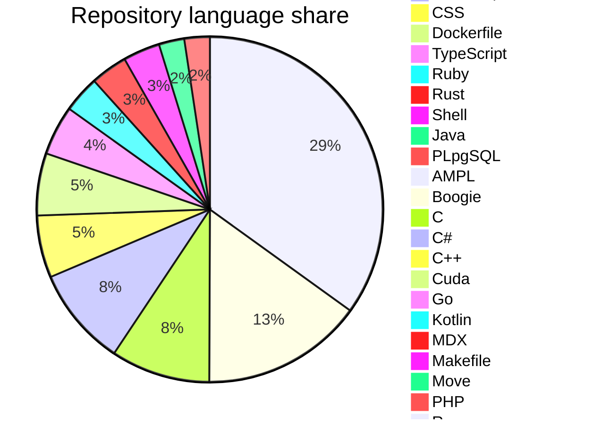

## Senior Software Engineer

Senior software engineer focused on **production systems**, **machine learning**, **MLOps**, and **applied research**. Work spans end-to-end development, model deployment, data pipelines, and collaboration with product and platform teams to ship reliable, scalable software and ML systems.

<!-- github-stats:auto:start member-line -->
**GitHub:** member since **17 July 2021** (~**5 years** on the platform).
<!-- github-stats:auto:end member-line -->
The GitHub statistics section reflects **all public repositories** returned for this account (names, counts, primary-language mix, and per-repository language data from the GitHub API).

---

## My services

- **Game automation:** build and maintain bots for **flash/browser games** (e.g. real-time input, state parsing, anti-detection patterns where appropriate).
- **Token & community growth:** design and implement **airdrop** eligibility, distribution, and anti-abuse strategy (snapshot rules, claiming flows, monitoring).
- **Trading & markets tooling:** bots and data pipelines for exchanges, prediction markets, and indicators (see public repositories).
- **Web3 & bots:** smart contracts, TON/Tact, NFT and marketplace backends, Telegram and Discord automation.
- **ML & agents:** production ML, LLM/RAG workflows, and coding-agent style automation.

---

## GitHub statistics

<!-- github-stats:auto:start core-stats -->
*Languages come from the GitHub `languages` API on each **public** repository. A repository can list several languages; the **table** counts how many repos include each language. The **pie** uses the same counts normalized so the slices sum to 100% (share of all repo–language entries). **Last updated:** April 2026.*

### Account snapshot

| Metric | Value |
| --- | --- |
| **Joined** | 17 July 2021 (~4.7 calendar years; **~5 years** rounded) |
| **Public repositories** | **61** |
| **Followers · Following** | **215** · **106** |
| **Stars received** | **24** |
| **Pull requests · Issues** (opened; GitHub search on visible/indexed items) | **6** · **1** |

### Languages by code volume

*61 public repositories; **% of repos** is repos that list the language / total repos (can exceed 100% in sum because one repo lists multiple languages).*

| Language | Repositories | % of repos |
| --- | ---: | ---: |
| Python | 30 | 49.2% |
| Jupyter Notebook | 13 | 21.3% |
| HTML | 8 | 13.1% |
| JavaScript | 8 | 13.1% |
| CSS | 5 | 8.2% |
| Dockerfile | 5 | 8.2% |
| TypeScript | 4 | 6.6% |
| Ruby | 3 | 4.9% |
| Rust | 3 | 4.9% |
| Shell | 3 | 4.9% |
| Java | 2 | 3.3% |
| PLpgSQL | 2 | 3.3% |
| AMPL | 1 | 1.6% |
| Boogie | 1 | 1.6% |
| C | 1 | 1.6% |
| C# | 1 | 1.6% |
| C++ | 1 | 1.6% |
| Cuda | 1 | 1.6% |
| Go | 1 | 1.6% |
| Kotlin | 1 | 1.6% |
| MDX | 1 | 1.6% |
| Makefile | 1 | 1.6% |
| Move | 1 | 1.6% |
| PHP | 1 | 1.6% |
| R | 1 | 1.6% |
| SCSS | 1 | 1.6% |
| Swift | 1 | 1.6% |
| Tree-sitter Query | 1 | 1.6% |

### Language mix (visualization)

<!-- github-stats:auto:end core-stats -->

---

## Skills and tools

The following reflects languages, frameworks, and platforms used across **public** repositories (see the generated language list) and in broader professional work.

<!-- github-stats:auto:start skills-languages -->
**Languages:** JavaScript / TypeScript, C / C++, AMPL, Boogie, C#, CSS, Cuda, Dockerfile, Go, HTML, Java, Jupyter (notebooks), Kotlin, Makefile, MDX, Move, PHP, PLpgSQL, Python, R, Ruby, Rust, SCSS, Shell, Swift, Tact (TON), Tree-sitter Query, Matlab, SQL
<!-- github-stats:auto:end skills-languages -->

**Machine learning & AI:** classical ML, deep learning, computer vision, NLP, PyTorch, TensorFlow, Keras, OpenCV, MediaPipe, EfficientNet, StyleGAN2, neural ODEs, recommendation systems (e.g. LightFM), LLMs, RAG, LangChain / LangGraph, QLoRA / fine-tuning, coding agents and SWE-bench style tooling

**Data & analytics:** data science, ETL, visualization, data engineering, modeling, mining and quality; time series and statistics

**Web & applications:** Node.js, React, Django, Flask, Discord bots, VS Code extensions, ServiceNow (including Utah NeedIt training flows), Drupal

**Cloud, infra & MLOps:** Azure, Terraform, container workflows, Cloudflare R2, active-container style deployments

**Other domains:** blockchain and Web3 (e.g. IOTA, TON, Bittensor agents), crypto exchange data, quantum demos (QFT), trading and strategy analysis (non-personal)

---

### Repositories

<!-- github-stats:auto:start repos -->
**61** public repositories (verified **2026-04-13** against the GitHub API; each row includes the GitHub description when it is informative, otherwise a short generated summary).

| Repository | Description |
| --- | --- |
| [active-containers-ui](https://github.com/stevewoz1234567890/active-containers-ui) | Active Containers UI — public Python repository. |
| [ai-agent-learning](https://github.com/stevewoz1234567890/ai-agent-learning) | AI Agent Learning — public Python repository. |
| [AI-Translation](https://github.com/stevewoz1234567890/AI-Translation) | AI Translation — public Python repository. |
| [awesome-elegant-prompts](https://github.com/stevewoz1234567890/awesome-elegant-prompts) | Awesome Elegant Prompts — public Python repository. |
| [beat-gpt4o](https://github.com/stevewoz1234567890/beat-gpt4o) | Beat GPT-4o — public Python repository. |
| [Bellman-euqation](https://github.com/stevewoz1234567890/Bellman-euqation) | Bellman Euqation — public Jupyter Notebook repository. |
| [canon-camera-controller](https://github.com/stevewoz1234567890/canon-camera-controller) | Canon Camera Controller — public Python repository. |
| [capsult-network-on-brats](https://github.com/stevewoz1234567890/capsult-network-on-brats) | Capsult Network On BRATS — public Jupyter Notebook repository. |
| [claude-code-discussion](https://github.com/stevewoz1234567890/claude-code-discussion) | Claude Code Discussion — public code repository. |
| [Clojure-discussion](https://github.com/stevewoz1234567890/Clojure-discussion) | Clojure Discussion — public code repository. |
| [coco-format-in-pytorch](https://github.com/stevewoz1234567890/coco-format-in-pytorch) | COCO Format In Pytorch — public Jupyter Notebook repository. |
| [code-generation-agent-for-SWEbench](https://github.com/stevewoz1234567890/code-generation-agent-for-SWEbench) | Code Generation Agent For SWEbench — public Python repository. |
| [code_generation_langchain](https://github.com/stevewoz1234567890/code_generation_langchain) | Code Generation Langchain — public Jupyter Notebook repository. |
| [coffee-analysis](https://github.com/stevewoz1234567890/coffee-analysis) | Coffee Analysis — public Jupyter Notebook repository. |
| [Complex-Network-Theory](https://github.com/stevewoz1234567890/Complex-Network-Theory) | Complex Network Theory — public code repository. |
| [cortnie](https://github.com/stevewoz1234567890/cortnie) | Cortnie — public HTML repository. |
| [CS2210a_DS_java](https://github.com/stevewoz1234567890/CS2210a_DS_java) | CS2210a DS Java — public Java repository. |
| [CSCI-E-25-lecture](https://github.com/stevewoz1234567890/CSCI-E-25-lecture) | CSCI E 25 Lecture — public Jupyter Notebook repository. |
| [devtraining-needit-utah](https://github.com/stevewoz1234567890/devtraining-needit-utah) | Devtraining Needit Utah — public code repository. |
| [disocrd-bot](https://github.com/stevewoz1234567890/disocrd-bot) | Disocrd Bot — public Python repository. |
| [drupal-issues](https://github.com/stevewoz1234567890/drupal-issues) | Drupal Issues — public code repository. |
| [E-commerce-Returns-Prediction-Challenge](https://github.com/stevewoz1234567890/E-commerce-Returns-Prediction-Challenge) | E Commerce Returns Prediction Challenge — public Jupyter Notebook repository. |
| [Exponential-Grid-Navigation-System](https://github.com/stevewoz1234567890/Exponential-Grid-Navigation-System) | Exponential Grid Navigation System — public C# repository. |
| [Fetch-Data-Crypto-Exchange](https://github.com/stevewoz1234567890/Fetch-Data-Crypto-Exchange) | Fetch Data Crypto Exchange — public Python repository. |
| [firebase-discussion](https://github.com/stevewoz1234567890/firebase-discussion) | Firebase Discussion — public code repository. |
| [flight-path-tracker](https://github.com/stevewoz1234567890/flight-path-tracker) | Flight Path Tracker — public JavaScript repository. |
| [Foreign_Body_Detection_Xray_Deep_Learning](https://github.com/stevewoz1234567890/Foreign_Body_Detection_Xray_Deep_Learning) | A deep neural network trained to detect foreign bodies on chest X-rays |
| [Get_Finshi_MTG](https://github.com/stevewoz1234567890/Get_Finshi_MTG) | Get Finshi MTG — public Jupyter Notebook repository. |
| [huggingface.co-issues](https://github.com/stevewoz1234567890/huggingface.co-issues) | Huggingface.co Issues — public code repository. |
| [iota](https://github.com/stevewoz1234567890/iota) | Bringing the real world to Web3 with a scalable, decentralized and programmable DLT infrastructure. |
| [lightfm](https://github.com/stevewoz1234567890/lightfm) | A Python implementation of LightFM, a hybrid recommendation algorithm. |
| [Meza](https://github.com/stevewoz1234567890/Meza) | Meza — public Java repository. |
| [MQDF-with-MNIST](https://github.com/stevewoz1234567890/MQDF-with-MNIST) | MQDF With MNIST — public Jupyter Notebook repository. |
| [Name-Classification](https://github.com/stevewoz1234567890/Name-Classification) | Name Classification — public Python repository. |
| [Neural_ODEs](https://github.com/stevewoz1234567890/Neural_ODEs) | Neural ODEs — public Jupyter Notebook repository. |
| [openclaw](https://github.com/stevewoz1234567890/openclaw) | Your own personal AI assistant. Any OS. Any Platform. The lobster way. 🦞 |
| [Packaging-Optimization](https://github.com/stevewoz1234567890/Packaging-Optimization) | Packaging Optimization — public Python repository. |
| [Pose-Classification-with-Mediapipe](https://github.com/stevewoz1234567890/Pose-Classification-with-Mediapipe) | Pose Classification With Mediapipe — public Python repository. |
| [powerball](https://github.com/stevewoz1234567890/powerball) | Powerball — public Python repository. |
| [qlora](https://github.com/stevewoz1234567890/qlora) | Qlora — public Jupyter Notebook repository. |
| [Quantum-Fourier-Transform](https://github.com/stevewoz1234567890/Quantum-Fourier-Transform) | Quantum Fourier Transform — public Python repository. |
| [Qui-Gon_LP](https://github.com/stevewoz1234567890/Qui-Gon_LP) | Qui Gon LP — public AMPL repository. |
| [ridges](https://github.com/stevewoz1234567890/ridges) | Building Software Agents On Bittensor |
| [Ruby-and-Rails-Discussion](https://github.com/stevewoz1234567890/Ruby-and-Rails-Discussion) | Ruby And Rails Discussion — public Ruby repository. |
| [rust-test](https://github.com/stevewoz1234567890/rust-test) | Rust Test — public Rust repository. |
| [scrap_linkedin_llm](https://github.com/stevewoz1234567890/scrap_linkedin_llm) | Scrap Linkedin LLM — public HTML repository. |
| [scrum-board-node](https://github.com/stevewoz1234567890/scrum-board-node) | Scrum Board Node — public JavaScript repository. |
| [shape_predictor_81_face_landmarks](https://github.com/stevewoz1234567890/shape_predictor_81_face_landmarks) | Custom shape predictor model trained to find 81 facial feature landmarks given any image |
| [sierpinski](https://github.com/stevewoz1234567890/sierpinski) | Sierpinski — public Python repository. |
| [Skin-Cancer-Classification-using-EfficientNet](https://github.com/stevewoz1234567890/Skin-Cancer-Classification-using-EfficientNet) | Skin Cancer Classification Using Efficient Net — public Jupyter Notebook repository. |
| [sn-learn-javascript](https://github.com/stevewoz1234567890/sn-learn-javascript) | Example scripts from the series "Learn JavaScript on the Now Platform" |
| [spectrographic](https://github.com/stevewoz1234567890/spectrographic) | Spectrographic — public Python repository. |
| [stats-test](https://github.com/stevewoz1234567890/stats-test) | Stats Test — public code repository. |
| [stevewoz1234567890](https://github.com/stevewoz1234567890/stevewoz1234567890) | Stevewoz1234567890 — public Python repository. |
| [StyleGAN2](https://github.com/stevewoz1234567890/StyleGAN2) | Style GAN2 — public Python repository. |
| [tact-script-in-Ton](https://github.com/stevewoz1234567890/tact-script-in-Ton) | Tact Script In TON — public TypeScript repository. |
| [video-hover-effect](https://github.com/stevewoz1234567890/video-hover-effect) | Video Hover Effect — public HTML repository. |
| [vscode-extension-test](https://github.com/stevewoz1234567890/vscode-extension-test) | Vscode Extension Test — public JavaScript repository. |
| [Wine-Name-Match](https://github.com/stevewoz1234567890/Wine-Name-Match) | Wine Name Match — public Python repository. |
| [wishlist](https://github.com/stevewoz1234567890/wishlist) | Wish List Now Platform Application |
| [x-algorithm](https://github.com/stevewoz1234567890/x-algorithm) | Algorithm powering the For You feed on X |

*Last synced from the GitHub API: 2026-04-13 — public repository list and descriptions (token recommended for rate limits).*
<!-- github-stats:auto:end repos -->
